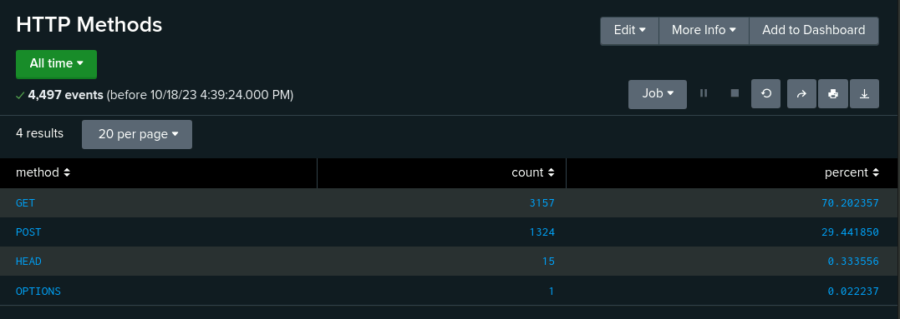

## Overview
For this project, we played the role of a SOC analyst at a small company called Virtual Space Industries (VSI). The scenario that was given was that a rival company called JobeCorp was rumored to launch a cyberattack on VSI. Our job was to create a SIEM that would monitor potential attacks on VSI's systems and applications. The team was given **Windows Server Logs** and **Apache Server Logs** that represented normal internet activity. The Windows Server Logs contain intellectual property of VSI's next-generation virtual reality programs while Apache Server Logs are from VSI's main public-facing website. Baseline logs were then compared to attack logs to check the efficacy of the thresholds chosen for alerts. 

## Reviewing Normal Windows Server Logs

We first analyzed Windows Server Logs of normal activity. The fields we looked at were signature_id, signature, user, status, and severity. Three reports were created: a report of the table of signatures and associated signature ID's, severity levels and the percentages of each level, and a comparison of the success and failure of Windows activity. Three Alerts were created based on the fields of failed Windows activity, successful login signature, and deleted user account signature. All reports and emails were sent to SOC@VSI-company.com. 

### Windows Server Logs Reports

Table of signatures and associated signature IDs was created from the the signature_id field for identification: 

Severity levels and the percentages of each level report allowed for quick understanding of the severity levels of the logs being viewed:

Comparison of the success and failure of Windows activity presented if there was any suspicious activity based on the number of failed activities on the server: 

### Windows Server Logs Alerts

Hourly count of failed Windows activity was created as an alert to notify of any suspicious increase if the amount passed the chosen threshold: 

We chose 15 counts as our threshold based on our baseline which we based off of the highest number of events that could possibly happen within the hour. 

$%$

Hourly count of the signature "an account was successfully logged on" was created as an alert to notify of any suspicious increase if the amount passed the chosen threshold:

Similar to the process of our previous alert, we chose 22 counts as our threshold because normal activity indicates the highest activity as 21 counts within an hour. 

$~$

Hourly count of the signature "a user account was deleted" was created as an alert to notify of any suspicious increase if the amount passed the chosen threshold: 

Finally, we chose 25 counts as our threshold based on the highest count being 22 events in one hour. 

### Windows Server Monitoring Logs Dashboard

Once these reports and alerts were created, a dashboard was created for easier viewing. 

## Reviewing Normal Apache Server Logs
Next, we analyzed Apache Server Logs of normal activity. The fields we looked at were methods, referer_domain, status, clientip, and useragent. Three reports were also generated according to these fields - a table of different HTTP request methods, top 10 referrer domains to VSI's website, and the count of each HTTP response code. Two alerts were made to follow up after the reports: hourly international activity and hourly count of the HTTP POST request method. All reports and emails were sent to SOC@VSI-company.com. 

### Apache Server Logs Reports

Table of HTTP Request Methods activity: 

Top 10 referrer domains to VSI's website:

Count of each HTTP Response Codes: 

### Apache Server Logs Alerts

Hourly count of international activity was created as an alert to notify of any suspicious increase if the amount passed the chosen threshold: 

From the normal activity count per hour, the highest number count we found was 120 events and so we chose 125 counts as our threshold. 

Hourly count of the HTTP POST Request Method was created as an alert to notify of any suspicious increase if the amount passed the chosen threshold:

The highest number of events that we found in our baseline was 7 and chose a threshold of 10. In general, our thresholds never strayed too far from the highest count that we found.

### Apache Server Logs Dashboard

After successfully creating the reports and alerts, we created a dashboard to view fields that we thought were significant to know. 

## Reviewing Attack Activity Logs

Next, we were provided logs from cyber attacks that VSI experienced due to (the most likely suspect) JobeCorp. The solutions that we got from normal activity logs were put to the test to check if they worked. 

## Windows Server Attack Logs

When we compared the reports, we found a striking difference in numbers compared to baseline logs in our reports. Most of our alerts were set off as well with the exception of the "users deleted" alert. 

### Windows Server Attack Logs Reports

Severity Levels:
+ baseline

+ attack

The attack log indicates a major difference in statistical numbers compared to normal activity in terms of severity level. There was a jump from 329 events to 1111 events in High severity and a slight decrease in informational severity from 4435 counts to 4383 counts. 

$~$

Success and failure login status:
+ baseline

+ attack

We also detected suspicious activity when we compared baseline logs of successful and failed login attempts compared to the counts found in the attack. The number of successful logins rose significantly from 4622 to 5856 counts and the number of failed logins decreased slightly from 142 events to 93 events. The 1k+ increase may indicate a possible brute force attack done on the site. 

### Windows Server Attack Logs Alerts

Failed Windows Activity Alert: 

From the threshold we chose, an alert would have been sent to the SOC team. Specifically, it would have notified the team of 35 events that occurred at 8 AM on Wednesday, March 25th, 2020. However, due to the much higher count compared to the number of events, we would increase the threshold to 25. 

$~$

Successful Login Alert:

This alert would have notified the team of 23 events, 196 events, and 77 events that happened at consecutive hours on the same day. The 23 events happened at 10 AM, 196 events at 11 AM, and 77 events at 12 PM. Because this alert had notified of 23 events that seem to be of normal range compared to the other two counts, it will be important to increase the threshold up to 30 counts to reduce alert fatigue.  

$~$

Deleted User Alert: 

Last but not least, this alert did not detect suspicious volume as the attack log presents that the threshold was not past nor was there any significant statistical difference. 

### Windows Server Attack Logs Dashboard

$~$

Based on the dashboard that we created, we can immediately see suspicious activity from two signatures and two users. 
+ signatures
  1. “user accounts getting locked out” - **896 peak count** at 2:00 AM on Wednesday, March 25th, 2020 (total of 1,811 events from 12:00 AM - 3:00 AM) 
  2. “an attempt being made to reset password” - **1,258 peak count** at 9:00 AM on Wednesday, March 25th, 2020 (total of 1,258 events from 8:00 AM - 11:00 AM)
+ users
  1. user_a - began at 12:00 AM and ended at 3:00 AM - **984 peak count** at 2:00 AM on Wednesday, March 25th, 2020 (total of 1,258 events from 12:00 AM - 3:00 AM)
  2. user_k - began at 8:00 AM and ended at 11:00 AM - **1,256 peak count** at 9:00 AM on Wednesday, March 25th, 2020
(total of 1,811 events from 8:00 AM - 11:00 AM)

## Apache Attack Logs

Similar to the results in our Windows Server Attack Logs, the Apache Attack Logs also found a significant difference in numbers across the board. 

### Apache Attack Logs Reports

Table of HTTP Request Methods activity: 
+ baseline

+ attack

When we compared the HTTP Request Methods, we noticed there were suspicious changes in HTTP methods in both GET and POST methods. HTTP GET method had a sharp decrease in normal activity from 9851 counts in a normal log to 3157 counts in an attack log. HTTP POST method had the opposite effect of a drastic increase compared to a normal log that has a 106 count while an attack log has 1324 counts. 

$~$

Top 10 referrer domains to VSI's website:
+ baseline

+ attack

Overall, there was a sharp decline in all of the top 10 referrer domains. This could have raised the possibility of the server not working as usual. 

$~$

Count of each HTTP Response Codes: 
+ baseline

+ attack

Finally, we saw a significant decline of events in all of the HTTP response codes, possibly showing that the server was hit with a Denial of Service attack. 

### Apache Attack Logs Alerts

International Activity Alert: 

Our alert would have been triggered from this attack as the event count of 937 at 9:00 PM from the attack log is significantly greater than our threshold. To decrease alert fatigue, we would need to adjust the threshold from 125 to 200. 

HTTP POST Alert:

The HTTP Post alert had a significantly higher increase at 8:00 PM on the same day. As the rest of the hours seem to have no more than 1 event, I would slightly increase the threshold from 10 to 15 as a precautionary measure. 

### Apache Attack Logs Dashboard

$~$

Based on the dashboard that we created, we can immediately see suspicious activity from two HTTP requests, the cluster map, the URI data, and user agent. 
+ HTTP Requests
  1. HTTP GET Method - **729 peak count** at 6:00 PM  on Wednesday, March 25th, 2020 (total of 1,811 events from 5:00 PM - 7:00 PM) 
  2. HTTP POST Method - **1,296 peak count** at 8:00 PM on Wednesday, March 25th, 2020 (total of 1,258 events from 7:00 AM - 9:00 PM)
+ Cluster Map and Bar Graph of Top 10 Countries
  1. US (Ashburn, Virginia) - **668 geolocation count** on Wednesday, March 25th, 2020 (total of 2,000)
  2. Ukraine (Kyiv) - **439 geolocation count** on Wednesday, March 25th, 2020 (total of 877)
+ URI data
  1. /VSI_Account_logon.php - **1,323 total count** on Wednesday, March 25th, 2020 
+ User Agent
  1. Mozilla/4.0 - **1,296 total count** on Wednesday, March 25th, 2020 

## Conclusion

Our team concluded that the suspect (JobeCorp) had most likely launched a brute force attack that was performed on VSI’s account logon page which also resulted in a DoS attack on March 25th, 2020. Future mitigations that VSI should look into are using Dual MFA, adding CAPTCHA, strong password policy, and phishing training. 

